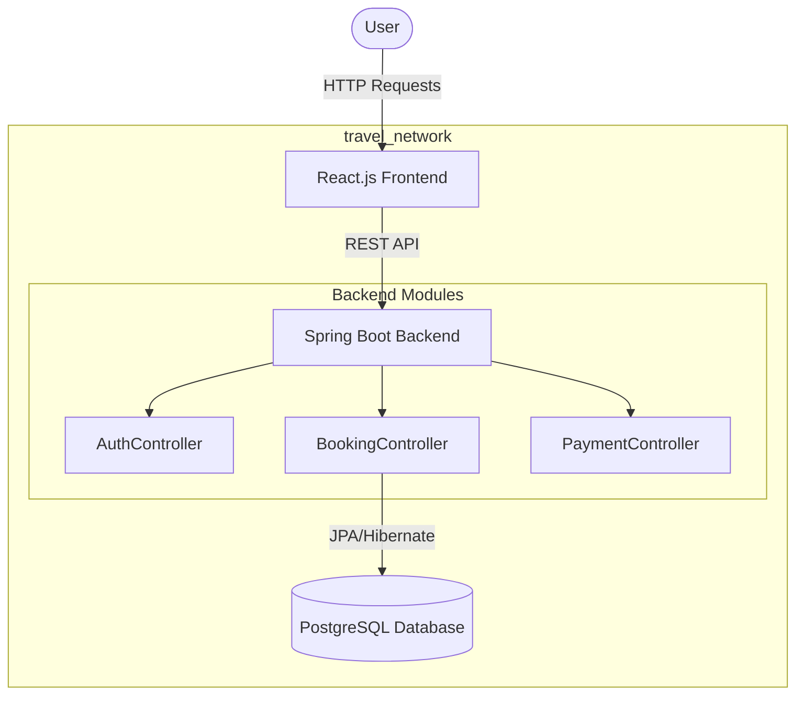

# Transport Booking System

## Project Explanation
This is a beginner-friendly, full-stack Transport Booking System designed to showcase modern DevOps practices including Dockerization, CI/CD pipelines, and microservice-style logical architecture. It allows users to login, search, book, and cancel tickets for buses, trains, and flights. 

The architecture is kept intentionally simple:
- **Frontend**: A sleek, responsive React single-page application.
- **Backend**: A modular Spring Boot application providing REST APIs.
- **Database**: PostgreSQL to ensure data persistence.

## Presentation-Friendly Architecture Diagram

## Database Schema
The system uses a simple, denormalized `tickets` table suitable for beginner explanations:
- `id` (Long, Primary Key)
- `type` (String: BUS, TRAIN, FLIGHT)
- `source` (String)
- `destination` (String)
- `date` (String)
- `status` (String: BOOKED, CANCELLED)
- `userEmail` (String)
- `price` (Double)

## Working Flow
1. **User Login/Registration**: The user logs in via the Auth Service (mocked for simplicity).
2. **Search Tickets**: The user enters source, destination, and type on the Dashboard.
3. **Book Ticket**: Upon clicking book, a POST request is sent to the Booking Service.
4. **Payment Process**: Simulated via the Payment Service.
5. **View/Cancel Bookings**: Users can view their past and active bookings and cancel them if needed.

## API Flow Explanation
- `POST /api/auth/login`: Accepts credentials, returns a mock JWT token and status.
- `POST /api/bookings/book`: Takes a ticket JSON payload, saves it as 'BOOKED', returns the saved entity.
- `GET /api/bookings/user/{email}`: Retrieves all bookings for a specific user.
- `PUT /api/bookings/cancel/{id}`: Finds a ticket by ID, sets status to 'CANCELLED'.
- `POST /api/payment/process`: Mocks payment gateway interaction.

## DevOps & CI/CD Explanation
### Docker
We created two `Dockerfile`s using multi-stage builds. Multi-stage builds reduce image size by discarding build tools in the final image.
- **Frontend Dockerfile**: Uses Node to build the React app, then NGINX to serve the static files.
- **Backend Dockerfile**: Uses Maven to compile the jar, then uses a lightweight JRE image to run it.
- **Docker Compose**: Orchestrates the entire environment. It maps ports, injects environment variables, and creates a private bridge network (`travel_network`) so containers can talk securely.

### GitHub Actions (Continuous Integration)
Located in `.github/workflows/ci.yml`. Triggered on push or PR to `main`.
It checks out the code, sets up Java and Node, builds both projects to verify there are no compile errors, and optionally builds Docker images.

### Jenkins (Continuous Delivery)
The `Jenkinsfile` defines a pipeline to build the frontend and backend, package them into Docker images, and push them to Docker Hub. It ends with a deployment step pulling the latest images via `docker-compose`.

## Setup Steps
### Prerequisites
- Docker and Docker Compose installed.

### Run Locally via Docker
1. Navigate to the project root directory.
2. Run `docker-compose up --build -d`
3. Access the frontend at `http://localhost`
4. Access the backend APIs at `http://localhost:8080/api/...`

### Run Locally (Dev Mode)
1. Ensure PostgreSQL is running locally on port 5432 with `postgres` user and pass.
2. Start the Backend: `cd backend && mvn spring-boot:run`
3. Start the Frontend: `cd frontend && npm run dev`
